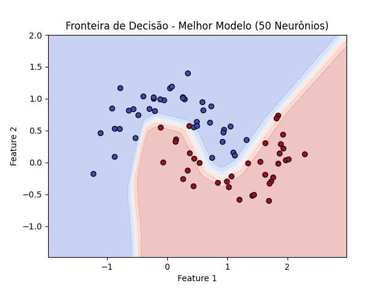

# **Instituto Federal do Ceará - Campus Maracanaú**  
## Inteligência Artificial(IA)
**Professor:** Amaurí Holanda
### **Dupla:**
**Aluno:** Francisco Aldenor Silva Neto  
**Aluno:** Isabelly Pinheiro da Costa

# Questão 1: Regressão Linear. 
Implemente um modelo de regressão linear. Para isso, utilize um conjunto de dados sintético gerado com a equação:
<p align="center">
y = 3x + 5 + ε(1)
</p>
onde x segue distribuição uniforme entre -10 e 10 e ε ́e um ruído gaussiano com média zero e desvio padrão de 2.

Faça os seguintes passos:

1. Gere um conjunto de dados com pelo menos 100 pontos.
```python
N = 100
x = np.random.uniform(-10, 10, N)  # Distribuição uniforme entre -10 e 10
epsilon = np.random.normal(0, 2, N)  # Ruído gaussiano com média 0 e desvio 2
y = 3 * x + 5 + epsilon  # Equação dada

# Convertendo para arrays 2D para regressão
X = np.vstack((np.ones(N), x)).T  # Adicionando termo de viés
```
2. Divida os dados em treino (80%) e teste (20%).
```python
train_size = int(0.8 * N)
X_train, X_test = X[:train_size], X[train_size:]
y_train, y_test = y[:train_size], y[train_size:]
```
3. Implemente modelos de regressão linear empregando:
  - a solução de mínimos quadrados (pseudo-inversa);
  ```python
  theta = np.linalg.inv(X_train.T @ X_train) @ X_train.T @ y_train

  # Previsões no conjunto de teste
  y_pred_pinv = X_test @ theta
  ```
  - uma rede neural com uma camada treinada via gradiente descendente utilizando MSE-Loss (Erro Quadrático Médio) e otimizador SGD.
  ```python
  # Implementação com Rede Neural
  class LinearRegressionNN(nn.Module):
    def __init__(self):
      super().__init__()
      self.linear = nn.Linear(1, 1)  # Apenas uma camada linear

    def forward(self, x):
      return self.linear(x)

  # Criando o modelo, função de perda e otimizador
  model = LinearRegressionNN()
  criterion = nn.MSELoss()
  optimizer = optim.SGD(model.parameters(), lr=0.01)

  # Treinamento da Rede Neural
  epochs = 1000
  for epoch in range(epochs):
    optimizer.zero_grad()
    y_pred = model(X_train_torch)
    loss = criterion(y_pred, y_train_torch)
    loss.backward()
    optimizer.step()

  # Obtendo os coeficientes treinados
  w_nn, b_nn = model.linear.weight.item(), model.linear.bias.item()

  # Predições da Rede Neural
  y_pred_nn = model(X_test_torch).detach().numpy()  
  ```
4. Apresente as soluções para cada um dos métodos acima.
```python
print("Coeficientes da regressão MSE:", theta)
print("Coeficientes da Rede Neural: w =", w_nn, ", b =", b_nn)
```
Coeficientes da regressão MSE: [4.8363477  2.93680725]

Coeficientes da Rede Neural: w = 2.9368069171905518 , b = 4.8363356590271

5. Avalie o desempenho dos modelos e visualize os resultados.
```python
# Cálculo dos Erros Médios Quadráticos (MSE)
mse_pinv = mean_squared_error(y_test, y_pred_pinv)
mse_nn = mean_squared_error(y_test, y_pred_nn)

print(f"MSE (Pseudo-Inversa): {mse_pinv:.4f}")
print(f"MSE (Rede Neural): {mse_nn:.4f}")

plt.scatter(x, y, label="Dados reais", alpha=0.6)
plt.plot(x[train_size:], y_pred_pinv, label="Pseudo-Inversa", color="red")
plt.plot(x[train_size:], y_pred_nn, label="Rede Neural", color="green", linestyle="dashed")
plt.legend()
plt.xlabel("x")
plt.ylabel("y")
plt.title("Regressão Linear: Pseudo-Inversa vs Rede Neural")
plt.savefig("imagens/Q1-regressao_linear.png")
plt.show()
```
MSE (Pseudo-Inversa): 3.9022

MSE (Rede Neural): 3.9022

  
O gráfico mostra a comparação entre os modelos de regressão linear obtidos com a solução de mínimos quadrados e a rede neural.

---

# Questão 2 - Regressão Logística para Classificação Binária. 
Implemente um modelo de regressão logística para resolver um problema de classificação binária utilizando um conjunto de dados sintético.

Faça os seguintes passos:
1. Utilize a função make classification da biblioteca Scikit-Learn para gerar um conjunto de dados com 500 amostras, 2 variáveis preditoras e 2 classes.
```python
X, y = make_classification(n_samples=500, n_features=2, n_classes=2, n_redundant=0, random_state=42)
```

2. Divida os dados em treino (70%) e teste (30%).
```python
X_train, X_test, y_train, y_test = train_test_split(X, y, test_size=0.3, random_state=42)
```

3. Implemente um modelo de regressão logística (i.e., rede neural com uma  ́unica camada de saída e ativação sigmoid).
```python
class LogisticRegressionGD:
  def __init__(self, learning_rate=0.01, epochs=1000):
    self.learning_rate = learning_rate
    self.epochs = epochs
    self.theta = None

  def sigmoid(self, z):
    return 1 / (1 + np.exp(-z))

  def fit(self, X, y):
    # Adicionando uma coluna de 1s
    X = np.c_[np.ones(X.shape[0]), X]
    self.theta = np.zeros(X.shape[1])

    # Treinamento via Gradiente Descendente Batch
    for _ in range(self.epochs):
        z = X @ self.theta
        h = self.sigmoid(z)
        gradient = (1 / len(y)) * X.T @ (h - y)
        self.theta -= self.learning_rate * gradient

  def predict(self, X):
    X = np.c_[np.ones(X.shape[0]), X]  
    return (self.sigmoid(X @ self.theta) >= 0.5).astype(int)
```

4. Treine o modelo utilizando gradiente descendente (versão não-estocástica) (conforme visto em sala).
```python
# Criando e treinando o modelo
model = LogisticRegressionGD(learning_rate=0.1, epochs=1000)
model.fit(X_train, y_train)
```

5. Avalie a acurácia no conjunto de teste e visualize a fronteira de decisão do classificador.
```python
# Avaliando a acurácia no conjunto de teste
y_pred = model.predict(X_test)
accuracy = np.mean(y_pred == y_test)
print(f"Acurácia no conjunto de teste: {accuracy:.4f}")

# Fronteira de decisão
x_min, x_max = X[:, 0].min() - 1, X[:, 0].max() + 1
y_min, y_max = X[:, 1].min() - 1, X[:, 1].max() + 1
xx, yy = np.meshgrid(np.linspace(x_min, x_max, 100), np.linspace(y_min, y_max, 100))
Z = model.predict(np.c_[xx.ravel(), yy.ravel()])
Z = Z.reshape(xx.shape)

plt.contourf(xx, yy, Z, alpha=0.3, cmap="coolwarm")
plt.scatter(X_test[:, 0], X_test[:, 1], c=y_test, cmap="coolwarm", edgecolors="k")
plt.xlabel("Feature 1")
plt.ylabel("Feature 2")
plt.title(f"Fronteira de decisão - Acurácia: {accuracy:.4f}")
plt.savefig("imagens/Q2-fronteira_decisao_logistica.png")
plt.show()
```
Acurácia no conjunto de teste: 0.8733
 
  
O gráfico apresenta a fronteira de decisão do classificador de regressão logística.

---

# Questão 3 - Classificação Binária com uma MLP e Seleçã de Neurônios.
Implemente uma rede neural do tipo MLP para a tarefa de classificação binária. Nesta questão, você deve usar um conjunto de validação para selecionar o número adequado de neurônios na camada oculta.

Faça os seguintes passos:
1. Utilize a função make moons da biblioteca Scikit-Learn para gerar um conjunto de dados com 500 amostras.
```python
X, y = make_moons(n_samples=500, noise=0.2, random_state=42)
```
2. Divida os dados em treino (70%), validação (15%) e teste (15%).
```python
# Dividindo os dados (70% treino, 15% validação, 15% teste)
X_train, X_temp, y_train, y_temp = train_test_split(X, y, test_size=0.3, random_state=42)
X_val, X_test, y_val, y_test = train_test_split(X_temp, y_temp, test_size=0.5, random_state=42)

# Convertendo para tensores PyTorch
X_train, y_train = torch.tensor(X_train, dtype=torch.float32), torch.tensor(y_train, dtype=torch.float32).unsqueeze(1)
X_val, y_val = torch.tensor(X_val, dtype=torch.float32), torch.tensor(y_val, dtype=torch.float32).unsqueeze(1)
X_test, y_test = torch.tensor(X_test, dtype=torch.float32), torch.tensor(y_test, dtype=torch.float32).unsqueeze(1)

# Criando DataLoaders
train_loader = DataLoader(TensorDataset(X_train, y_train), batch_size=32, shuffle=True)
val_loader = DataLoader(TensorDataset(X_val, y_val), batch_size=32, shuffle=False)
test_loader = DataLoader(TensorDataset(X_test, y_test), batch_size=32, shuffle=False)
```

3. Implemente uma MLP com:
  - Uma camada oculta com n neurônios e ativação ReLU.
  - Uma camada de saída com 1 neurônio e ativação sigmoid.
  - Utilize a função de perda BCELoss e o otimizador Adam ou SGD.

```python
# MLP
class MLP(nn.Module):
  def __init__(self, n_hidden):
    super(MLP, self).__init__()
    self.hidden = nn.Linear(2, n_hidden)  
    self.output = nn.Linear(n_hidden, 1)  

  def forward(self, x):
    x = torch.relu(self.hidden(x))  # Ativação ReLU
    x = torch.sigmoid(self.output(x))  # Ativação Sigmoid
    return x
```
4. Treine modelos com diferentes números de neurônios na camada oculta (exemplo: 5, 10, 20, 50).
```python
# Função para treinar o modelo
def train_model(n_hidden, epochs=100, lr=0.01):
    model = MLP(n_hidden)
    criterion = nn.BCELoss()
    optimizer = optim.Adam(model.parameters(), lr=lr)

    train_losses, val_losses = [], []

    for epoch in range(epochs):
        model.train()
        train_loss = 0
        for X_batch, y_batch in train_loader:
            optimizer.zero_grad()
            y_pred = model(X_batch)
            loss = criterion(y_pred, y_batch)
            loss.backward()
            optimizer.step()
            train_loss += loss.item()
        train_loss /= len(train_loader)
        train_losses.append(train_loss)

        # Avaliação no conjunto de validação
        model.eval()
        with torch.no_grad():
            val_loss = sum(criterion(model(X_v), y_v).item() for X_v, y_v in val_loader) / len(val_loader)
        val_losses.append(val_loss)
        print("Epoch", epoch+1, "/", epochs)
    return model, train_losses, val_losses
```
5. Plote a evolução da função custo (loss) ao longo do treinamento (épocas).
```python
# Testando diferentes números de neurônios na camada oculta
neurons_list = [5, 10, 20, 50]
best_model = None
best_val_loss = float('inf')
best_n = None

plt.figure(figsize=(10, 5))
for n in neurons_list:
  model, train_losses, val_losses = train_model(n_hidden=n)

  # Salvando o melhor modelo
  if val_losses[-1] < best_val_loss:
    best_val_loss = val_losses[-1]
    best_model = model
    best_n = n

  plt.plot(val_losses, label=f"{n} neurônios")

plt.xlabel("Épocas")
plt.ylabel("Loss (Erro)")
plt.legend()
plt.title("Evolução da Função Custo (Validação)")
plt.savefig("imagens/q3-evolucao_perda.png")
plt.show()
```

  
O gráfico mostra a evolução da função de perda (loss) ao longo do treinamento.

6. Escolha o melhor número de neurônios com base na menor perda no conjunto de validação.
```python
print(f"Melhor número de neurônios: {best_n} (Menor Loss: {best_val_loss:.4f})")
```
Melhor número de neurônios: 50 (Menor Loss: 0.0345)

7. Avalie o modelo escolhido no conjunto de teste e visualize a fronteira de decisão.
``` python
# Avaliação no conjunto de teste
best_model.eval()
with torch.no_grad():
  y_pred = (best_model(X_test) >= 0.5).float()
accuracy = (y_pred.eq(y_test).sum() / len(y_test)).item()
print(f"Acurácia no conjunto de teste: {accuracy:.4f}")

x_min, x_max = X[:, 0].min() - 0.5, X[:, 0].max() + 0.5
y_min, y_max = X[:, 1].min() - 0.5, X[:, 1].max() + 0.5
xx, yy = np.meshgrid(np.linspace(x_min, x_max, 100), np.linspace(y_min, y_max, 100))
X_grid = torch.tensor(np.c_[xx.ravel(), yy.ravel()], dtype=torch.float32)

with torch.no_grad():
  Z = best_model(X_grid).numpy().reshape(xx.shape)

plt.contourf(xx, yy, Z, alpha=0.3, cmap="coolwarm")
plt.scatter(X_test[:, 0], X_test[:, 1], c=y_test.numpy().flatten(), cmap="coolwarm", edgecolors="k")
plt.xlabel("Feature 1")
plt.ylabel("Feature 2")
plt.title(f"Fronteira de Decisão - Melhor Modelo ({best_n} Neurônios)")
plt.savefig("imagens/q3-fronteira_decisao_mlp.png")
plt.show()
```
Acurácia no conjunto de teste: 0.9867

  
O gráfico apresenta a fronteira de decisão do classificador MLP com o melhor número de neurônios na camada oculta.

---

# Questão 4 - Classificação Multiclasse com MLP. 
Agora, implemente uma rede neural para a classificação de imagens do conjunto MNIST (dígitos escritos à mão).
Faça os seguintes passos:
1. Carregue o conjunto de dados MNIST utilizando Torchvision ou Keras.
2. Normalize as imagens e divida em treino (80%) e teste (20%).
``` python
# Carregar o dataset MNIST e normalizar
transform = transforms.Compose([transforms.ToTensor(), transforms.Normalize((0.5,), (0.5,))])

train_dataset = torchvision.datasets.MNIST(root='./data', train=True, transform=transform, download=True)
test_dataset = torchvision.datasets.MNIST(root='./data', train=False, transform=transform, download=True)

# Dividir o conjunto de treino em treino (80%) e validação (20%)
train_size = int(0.8 * len(train_dataset))
val_size = len(train_dataset) - train_size
train_dataset, valid_dataset = torch.utils.data.random_split(train_dataset, [train_size, val_size])

train_loader = torch.utils.data.DataLoader(train_dataset, batch_size=64, shuffle=True)
valid_loader = torch.utils.data.DataLoader(valid_dataset, batch_size=64, shuffle=False)
test_loader = torch.utils.data.DataLoader(test_dataset, batch_size=64, shuffle=False)
```
3. Implemente uma rede neural MLP com:
    - Uma camada oculta de 128 neurônios e ativação ReLU.
    - Uma camada oculta de 64 neurônios e ativação ReLU.
    - Uma camada de saída com 10 neurônios e ativação softmax.
4. Utilize a função de perda CrossEntropyLoss e o otimizador Adam our SGD.
5. Treine a rede por 10 épocas e avalie a acurácia no conjunto de teste.
6. Exiba algumas previsões feitas pelo modelo, mostrando imagens e suas respectivas classes previstas.

**Resultados:**

- **Acurácia no Conjunto de Teste:**  
  Acurácia: 0.9625

**Gráficos Gerados:**  
  
O gráfico exibe algumas previsões feitas pelo modelo, mostrando imagens e suas respectivas classes previstas.

  
O gráfico mostra a evolução da acurácia durante o treinamento.

---

## Conclusão

Neste trabalho, foram implementados e avaliados diferentes modelos para tarefas de regressão e classificação. A regressão linear foi aplicada com duas abordagens, utilizando a solução de mínimos quadrados e uma rede neural simples. O modelo de regressão logística foi implementado para um problema de classificação binária, e a rede neural MLP foi aplicada para a classificação binária no conjunto `make_moons`. Finalmente, a rede neural MLP foi treinada no conjunto MNIST para a tarefa de classificação de imagens.

A análise dos gráficos gerados durante o treinamento e a avaliação final demonstraram o bom desempenho dos modelos, com destaque para a acurácia do modelo de rede neural no conjunto de testes, especialmente na questão 3 (MLP) e na questão 4 (MNIST).
