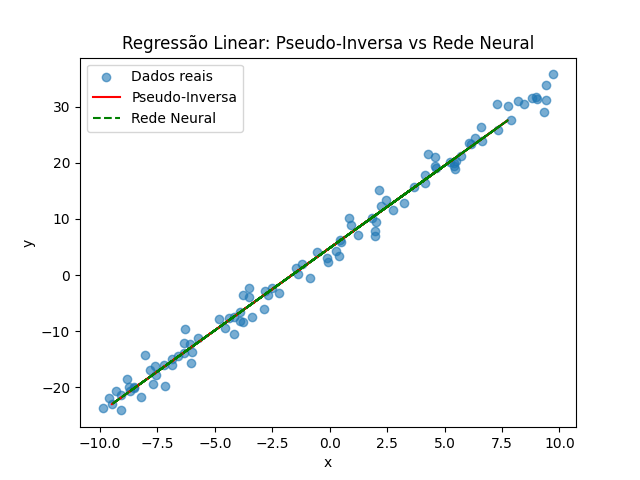
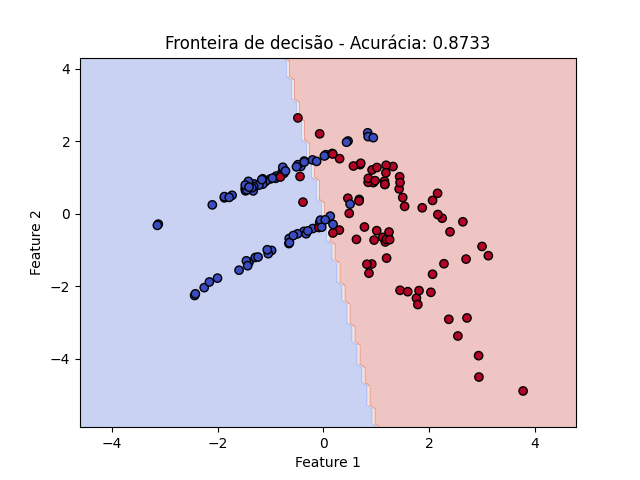
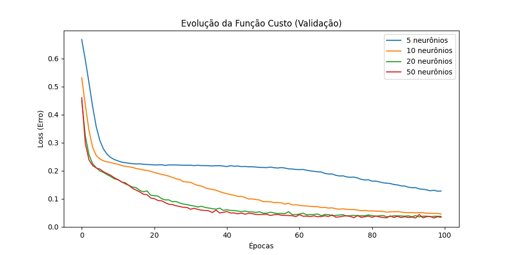
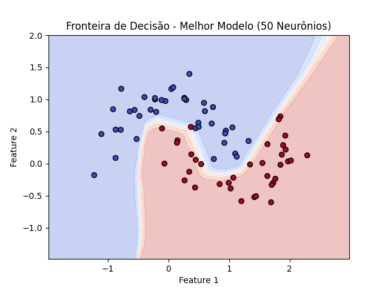
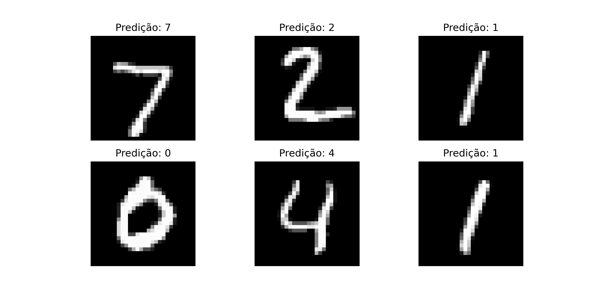
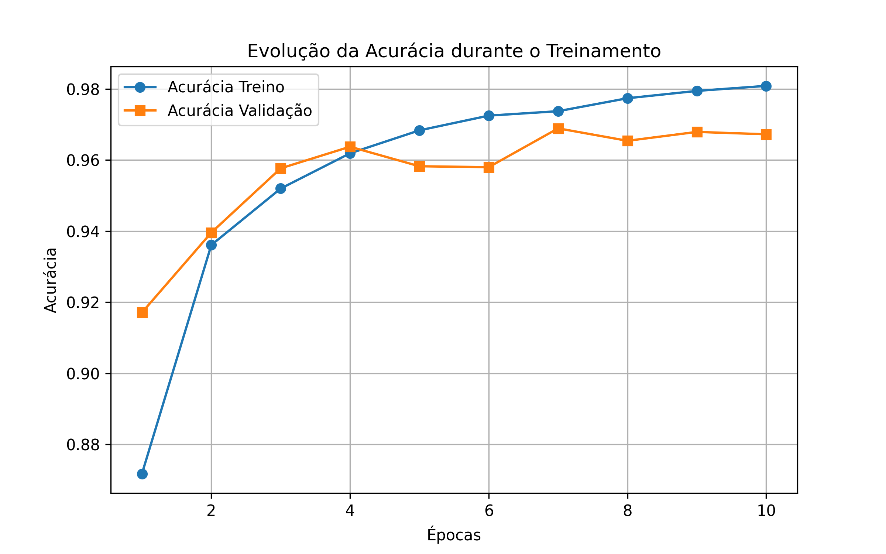

# **Instituto Federal do Ceará - Campus Maracanaú**  
## Inteligência Artificial(IA)
**Professor:** Amaurí Holanda
### **Dupla:**
**Aluno:** Francisco Aldenor Silva Neto  
**Aluno:** Isabelly Pinheiro da Costa

## Questão 1: Regressão Linear

**Objetivo:**  
Implementar um modelo de regressão linear utilizando um conjunto de dados sintético, com a equação \( y = 3x + 5 + \epsilon \), onde \( x \) segue distribuição uniforme entre -10 e 10 e \( \epsilon \) é um ruído gaussiano com média zero e desvio padrão de 2.

**Resultados:**

- **Coeficientes da Regressão Linear (Mínimos Quadrados):**  
  \( \theta_1 = 4.8363477 \), \( \theta_2 = 2.93680725 \)

- **Coeficientes da Rede Neural:**  
  \( w = 2.9368069171905518 \), \( b = 4.8363356590271 \)

- **Erro Quadrático Médio (MSE):**  
  - **Mínimos Quadrados (Pseudo-Inversa):** 3.9022  
  - **Rede Neural:** 3.9022

**Gráfico Gerado:**  
  
O gráfico mostra a comparação entre os modelos de regressão linear obtidos com a solução de mínimos quadrados e a rede neural.

---

## Questão 2: Regressão Logística

**Objetivo:**  
Implementar um modelo de regressão logística para resolver um problema de classificação binária utilizando um conjunto de dados sintético.

**Resultados:**

- **Acurácia no Conjunto de Teste:**  
  Acurácia: 0.8733

**Gráfico Gerado:**  
  
O gráfico apresenta a fronteira de decisão do classificador de regressão logística.

---

## Questão 3: Rede Neural MLP para Classificação Binária

**Objetivo:**  
Implementar uma rede neural do tipo MLP para a tarefa de classificação binária, utilizando o conjunto de dados `make_moons`.

**Resultados:**

- **Melhor Número de Neurônios:**  
  Melhor número de neurônios: 50 (Menor Loss: 0.0325)

- **Acurácia no Conjunto de Teste:**  
  Acurácia: 0.9867

**Gráficos Gerados:**  
  
O gráfico mostra a evolução da função de perda (loss) ao longo do treinamento.

  
O gráfico apresenta a fronteira de decisão do classificador MLP com o melhor número de neurônios na camada oculta.

---

## Questão 4: Rede Neural para Classificação de Imagens do Conjunto MNIST

**Objetivo:**  
Implementar uma rede neural para a classificação de imagens do conjunto MNIST.

**Resultados:**

- **Acurácia no Conjunto de Teste:**  
  Acurácia: 0.9625

**Gráficos Gerados:**  
  
O gráfico exibe algumas previsões feitas pelo modelo, mostrando imagens e suas respectivas classes previstas.

  
O gráfico mostra a evolução da acurácia durante o treinamento.

---

## Conclusão

Neste trabalho, foram implementados e avaliados diferentes modelos para tarefas de regressão e classificação. A regressão linear foi aplicada com duas abordagens, utilizando a solução de mínimos quadrados e uma rede neural simples. O modelo de regressão logística foi implementado para um problema de classificação binária, e a rede neural MLP foi aplicada para a classificação binária no conjunto `make_moons`. Finalmente, a rede neural MLP foi treinada no conjunto MNIST para a tarefa de classificação de imagens.

A análise dos gráficos gerados durante o treinamento e a avaliação final demonstraram o bom desempenho dos modelos, com destaque para a acurácia do modelo de rede neural no conjunto de testes, especialmente na questão 3 (MLP) e na questão 4 (MNIST).
